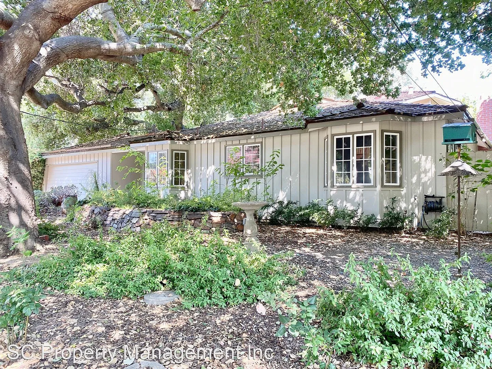

<!--
  ============================================================
  LUXURY LISTING SITE — CONTENT GUIDE
  ============================================================
  This single page contains every section of the brochure site.
  Search for the bracket tokens below and replace with real content:

    [ADDRESS]        → property street address / listing name
    [PRICE]           → asking price
    [BEDS] [BATHS] [SQFT] [LOT SIZE] → key stats
    [PLACEHOLDER PARAGRAPH] → editorial listing description copy
    [AGENT NAME] [BROKERAGE] [PHONE] [EMAIL] → agent/contact info
    [MLS#]            → MLS disclosure number
    YOUR_FORMSPREE_ID → replace in the contact form action URL
    Map query string  → replace the address in the Google Maps iframe src

  PHOTOS: every gallery/hero/floor-plan image is currently a placeholder
  
 with a data-label describing exactly
  which photo goes there. To swap in a real photo, replace the placeholder
  div's contents with an  — the
  surrounding container already has the correct aspect-ratio set in
  quartz/styles/custom.scss, so no layout/CSS changes are needed.
  ============================================================
-->

<nav id="site-nav" class="ll-nav">
  <a href="#hero" class="ll-nav__brand">[ADDRESS]</a>
  <button id="navToggle" class="ll-nav__toggle" aria-label="Toggle navigation" aria-expanded="false">
    
  </button>
  

    <a href="#hero">Home</a>
    <a href="#gallery">Gallery</a>
    <a href="#features">Features</a>
    <a href="#location">Location</a>
    <a href="#contact">Contact</a>
  

</nav>

<section id="hero" class="ll-hero reveal">
  

    
  

  

  

    
Offered at [PRICE]

    <h1 class="ll-hero__title">[ADDRESS]</h1>
    
[BEDS] Beds &nbsp;·&nbsp; [BATHS] Baths &nbsp;·&nbsp; [SQFT] Sq Ft

  

  <a href="#overview" class="ll-hero__scroll-cue" aria-label="Scroll to explore">
    Scroll to Explore
    <svg viewBox="0 0 24 24" aria-hidden="true"><path d="M12 4v15M5 12l7 7 7-7" /></svg>
  </a>
</section>

<section id="overview" class="ll-section reveal">
  

    

      

        [PRICE]
        Asking Price
      

      

        [BEDS]
        Bedrooms
      

      

        [BATHS]
        Bathrooms
      

      

        [SQFT]
        Square Feet
      

      

        [LOT SIZE]
        Lot Size
      

    

    

      <h2 class="ll-eyebrow-heading">The Property</h2>
      <!-- Swap: replace this paragraph with real editorial listing copy, roughly 100–150 words -->
      
[PLACEHOLDER PARAGRAPH]

    

  

</section>

<section id="gallery" class="ll-section ll-section--alt reveal">
  

    <h2 class="ll-eyebrow-heading">Gallery</h2>
    <h3 class="ll-gallery__group-title">Exterior</h3>
    

      <button class="photo-placeholder ll-photo" data-label="Exterior — Front Facade" type="button">
        <svg class="ph-icon" viewBox="0 0 24 24" aria-hidden="true"><path d="M4 16.5 8.5 10l3.5 4 3-4L20 16.5" /><circle cx="12" cy="12" r="9.25" /></svg>
        Exterior — Front Facade
      </button>
      <button class="photo-placeholder ll-photo" data-label="Exterior — Rear &amp; Pool" type="button">
        <svg class="ph-icon" viewBox="0 0 24 24" aria-hidden="true"><path d="M4 16.5 8.5 10l3.5 4 3-4L20 16.5" /><circle cx="12" cy="12" r="9.25" /></svg>
        Exterior — Rear &amp; Pool
      </button>
      <button class="photo-placeholder ll-photo" data-label="Exterior — Aerial View" type="button">
        <svg class="ph-icon" viewBox="0 0 24 24" aria-hidden="true"><path d="M4 16.5 8.5 10l3.5 4 3-4L20 16.5" /><circle cx="12" cy="12" r="9.25" /></svg>
        Exterior — Aerial View
      </button>
      <button class="photo-placeholder ll-photo" data-label="Exterior — Entry &amp; Motor Court" type="button">
        <svg class="ph-icon" viewBox="0 0 24 24" aria-hidden="true"><path d="M4 16.5 8.5 10l3.5 4 3-4L20 16.5" /><circle cx="12" cy="12" r="9.25" /></svg>
        Exterior — Entry &amp; Motor Court
      </button>
    

    <h3 class="ll-gallery__group-title">Kitchen</h3>
    

      <button class="photo-placeholder ll-photo" data-label="Kitchen — Main View" type="button">
        <svg class="ph-icon" viewBox="0 0 24 24" aria-hidden="true"><path d="M4 16.5 8.5 10l3.5 4 3-4L20 16.5" /><circle cx="12" cy="12" r="9.25" /></svg>
        Kitchen — Main View
      </button>
      <button class="photo-placeholder ll-photo" data-label="Kitchen — Island &amp; Range" type="button">
        <svg class="ph-icon" viewBox="0 0 24 24" aria-hidden="true"><path d="M4 16.5 8.5 10l3.5 4 3-4L20 16.5" /><circle cx="12" cy="12" r="9.25" /></svg>
        Kitchen — Island &amp; Range
      </button>
      <button class="photo-placeholder ll-photo" data-label="Kitchen — Breakfast Nook" type="button">
        <svg class="ph-icon" viewBox="0 0 24 24" aria-hidden="true"><path d="M4 16.5 8.5 10l3.5 4 3-4L20 16.5" /><circle cx="12" cy="12" r="9.25" /></svg>
        Kitchen — Breakfast Nook
      </button>
    

    <h3 class="ll-gallery__group-title">Living Spaces</h3>
    

      <button class="photo-placeholder ll-photo" data-label="Living — Great Room" type="button">
        <svg class="ph-icon" viewBox="0 0 24 24" aria-hidden="true"><path d="M4 16.5 8.5 10l3.5 4 3-4L20 16.5" /><circle cx="12" cy="12" r="9.25" /></svg>
        Living — Great Room
      </button>
      <button class="photo-placeholder ll-photo" data-label="Living — Family Room" type="button">
        <svg class="ph-icon" viewBox="0 0 24 24" aria-hidden="true"><path d="M4 16.5 8.5 10l3.5 4 3-4L20 16.5" /><circle cx="12" cy="12" r="9.25" /></svg>
        Living — Family Room
      </button>
      <button class="photo-placeholder ll-photo" data-label="Living — Formal Dining" type="button">
        <svg class="ph-icon" viewBox="0 0 24 24" aria-hidden="true"><path d="M4 16.5 8.5 10l3.5 4 3-4L20 16.5" /><circle cx="12" cy="12" r="9.25" /></svg>
        Living — Formal Dining
      </button>
    

    <h3 class="ll-gallery__group-title">Primary Suite</h3>
    

      <button class="photo-placeholder ll-photo" data-label="Primary Suite — Bedroom" type="button">
        <svg class="ph-icon" viewBox="0 0 24 24" aria-hidden="true"><path d="M4 16.5 8.5 10l3.5 4 3-4L20 16.5" /><circle cx="12" cy="12" r="9.25" /></svg>
        Primary Suite — Bedroom
      </button>
      <button class="photo-placeholder ll-photo" data-label="Primary Suite — Ensuite Bath" type="button">
        <svg class="ph-icon" viewBox="0 0 24 24" aria-hidden="true"><path d="M4 16.5 8.5 10l3.5 4 3-4L20 16.5" /><circle cx="12" cy="12" r="9.25" /></svg>
        Primary Suite — Ensuite Bath
      </button>
      <button class="photo-placeholder ll-photo" data-label="Primary Suite — Walk-in Closet" type="button">
        <svg class="ph-icon" viewBox="0 0 24 24" aria-hidden="true"><path d="M4 16.5 8.5 10l3.5 4 3-4L20 16.5" /><circle cx="12" cy="12" r="9.25" /></svg>
        Primary Suite — Walk-in Closet
      </button>
    

    <h3 class="ll-gallery__group-title">Outdoor &amp; Amenities</h3>
    

      <button class="photo-placeholder ll-photo" data-label="Outdoor — Pool &amp; Spa" type="button">
        <svg class="ph-icon" viewBox="0 0 24 24" aria-hidden="true"><path d="M4 16.5 8.5 10l3.5 4 3-4L20 16.5" /><circle cx="12" cy="12" r="9.25" /></svg>
        Outdoor — Pool &amp; Spa
      </button>
      <button class="photo-placeholder ll-photo" data-label="Outdoor — Covered Patio" type="button">
        <svg class="ph-icon" viewBox="0 0 24 24" aria-hidden="true"><path d="M4 16.5 8.5 10l3.5 4 3-4L20 16.5" /><circle cx="12" cy="12" r="9.25" /></svg>
        Outdoor — Covered Patio
      </button>
      <button class="photo-placeholder ll-photo" data-label="Outdoor — Guest House" type="button">
        <svg class="ph-icon" viewBox="0 0 24 24" aria-hidden="true"><path d="M4 16.5 8.5 10l3.5 4 3-4L20 16.5" /><circle cx="12" cy="12" r="9.25" /></svg>
        Outdoor — Guest House
      </button>
      <button class="photo-placeholder ll-photo" data-label="Outdoor — Gardens" type="button">
        <svg class="ph-icon" viewBox="0 0 24 24" aria-hidden="true"><path d="M4 16.5 8.5 10l3.5 4 3-4L20 16.5" /><circle cx="12" cy="12" r="9.25" /></svg>
        Outdoor — Gardens
      </button>
    

  

</section>

<section id="features" class="ll-section reveal">
  

    <h2 class="ll-eyebrow-heading">Features &amp; Amenities</h2>
    

      

        <svg class="ll-feature__icon" viewBox="0 0 24 24" aria-hidden="true"><circle cx="12" cy="12" r="9" /><path d="M12 7v5l3 2" /></svg>
        <h3>Architectural Pedigree</h3>
        
[Notable architect / design style / year built]

      

      

        <svg class="ll-feature__icon" viewBox="0 0 24 24" aria-hidden="true"><path d="M4 20v-8l8-6 8 6v8" /><path d="M9 20v-6h6v6" /><path d="M6.5 10.5a8 8 0 0 1 11 0" /></svg>
        <h3>Smart Home Integration</h3>
        
[Automated lighting, climate, security, and audio systems]

      

      

        <svg class="ll-feature__icon" viewBox="0 0 24 24" aria-hidden="true"><path d="M12 3l1.8 4.6L18 9l-4.2 1.4L12 15l-1.8-4.6L6 9l4.2-1.4z" /></svg>
        <h3>Chef's Kitchen &amp; Premium Finishes</h3>
        
[Imported stone, custom millwork, professional-grade appliances]

      

      

        <svg class="ll-feature__icon" viewBox="0 0 24 24" aria-hidden="true"><rect x="4" y="10" width="16" height="7" rx="1.5" /><path d="M6 10V8a2 2 0 0 1 2-2h8a2 2 0 0 1 2 2v2" /><path d="M4 17v2M20 17v2" /></svg>
        <h3>Primary Suite Retreat</h3>
        
[Spa-style bath, dual walk-in closets, private balcony]

      

      

        <svg class="ll-feature__icon" viewBox="0 0 24 24" aria-hidden="true"><circle cx="12" cy="12" r="4" /><path d="M12 2v3M12 19v3M4.2 4.2l2.1 2.1M17.7 17.7l2.1 2.1M2 12h3M19 12h3M4.2 19.8l2.1-2.1M17.7 6.3l2.1-2.1" /></svg>
        <h3>Resort-Style Outdoor Living</h3>
        
[Pool, spa, outdoor kitchen, mature landscaping]

      

      

        <svg class="ll-feature__icon" viewBox="0 0 24 24" aria-hidden="true"><path d="M6 20V10l6-6 6 6v10" /><path d="M9 20v-5a3 3 0 0 1 6 0v5" /></svg>
        <h3>Wine Cellar &amp; Bespoke Millwork</h3>
        
[Climate-controlled cellar, custom built-ins]

      

      

        <svg class="ll-feature__icon" viewBox="0 0 24 24" aria-hidden="true"><path d="M3 13l2-5a2 2 0 0 1 2-1h10a2 2 0 0 1 2 1l2 5" /><rect x="3" y="13" width="18" height="6" rx="1.5" /><circle cx="7.5" cy="19" r="1.2" /><circle cx="16.5" cy="19" r="1.2" /></svg>
        <h3>Three-Car Garage &amp; Motor Court</h3>
        
[Garage details, guest parking, gated entry]

      

      

        <svg class="ll-feature__icon" viewBox="0 0 24 24" aria-hidden="true"><path d="M12 3l7 3v6c0 4.5-3 7.5-7 9-4-1.5-7-4.5-7-9V6z" /></svg>
        <h3>Privacy &amp; Security</h3>
        
[Gated access, security systems, mature perimeter landscaping]

      

    

  

</section>

<section id="floorplan" class="ll-section ll-section--alt reveal">
  

    <h2 class="ll-eyebrow-heading">Floor Plan</h2>
    <!-- Swap: replace with the actual floor plan image, ideally with labeled rooms -->
    

      <svg class="ph-icon" viewBox="0 0 24 24" aria-hidden="true"><rect x="3" y="3" width="18" height="18" rx="1" /><path d="M3 9h18M9 9v12M15 3v6" /></svg>
      Floor Plan — Main Level
    

    
[Add room-by-room breakdown or a second floor plan for additional levels]

  

</section>

<section id="tour" class="ll-section reveal">
  

    <h2 class="ll-eyebrow-heading">Virtual Tour</h2>
    <!--
      Swap: replace this placeholder with an embedded video or Matterport 3D tour, e.g.:
      

        <iframe src="https://my.matterport.com/show/?m=YOUR_MODEL_ID" allowfullscreen loading="lazy"></iframe>
      

    -->
    

      <svg class="ph-icon" viewBox="0 0 24 24" aria-hidden="true"><circle cx="12" cy="12" r="9" /><path d="M10 8.5v7l6-3.5z" /></svg>
      Virtual Tour — Add Matterport or Video Embed
    

  

</section>

<section id="location" class="ll-section ll-section--alt reveal">
  

    <h2 class="ll-eyebrow-heading">Location</h2>
    

      <!-- Swap: replace the q= value with the real property address, keep &output=embed (no API key required) -->
      

        <iframe
          src="https://www.google.com/maps?q=[ADDRESS]&output=embed"
          width="100%"
          height="420"
          style="border:0"
          loading="lazy"
          referrerpolicy="no-referrer-when-downgrade"
          title="Property location map">
        </iframe>
      

      

        
[Neighborhood blurb — a few sentences on the area, character, and lifestyle]

        <ul class="ll-poi">
          <li>[X] min to [Nearby landmark or town center]</li>
          <li>[X] min to [Nearby beach / park / trailhead]</li>
          <li>[X] min to [Nearby shopping / dining district]</li>
          <li>[X] min to [Nearest airport]</li>
        </ul>
      

    

  

</section>

<section id="contact" class="ll-section reveal">
  

    <h2 class="ll-eyebrow-heading">Inquire</h2>
    

      

        

          <svg class="ph-icon" viewBox="0 0 24 24" aria-hidden="true"><circle cx="12" cy="8.5" r="4" /><path d="M4.5 20a7.5 7.5 0 0 1 15 0" /></svg>
          Agent Headshot
        

        <h3>[AGENT NAME]</h3>
        
[BROKERAGE]

        
<a href="tel:[PHONE]">[PHONE]</a>

        
<a href="mailto:[EMAIL]">[EMAIL]</a>

      

      <!-- Swap: replace YOUR_FORMSPREE_ID with your real Formspree form ID (formspree.io) -->
      <form class="ll-form" action="https://formspree.io/f/YOUR_FORMSPREE_ID" method="POST">
        <label>
          Name
          <input type="text" name="name" required />
        </label>
        <label>
          Email
          <input type="email" name="email" required />
        </label>
        <label>
          Phone
          <input type="tel" name="phone" />
        </label>
        <label>
          Message
          <textarea name="message" rows="4" placeholder="I'd like to schedule a private showing of [ADDRESS]."></textarea>
        </label>
        <button type="submit" class="ll-btn">Request a Private Showing</button>
        
Prefer email? Reach us directly at <a href="mailto:[EMAIL]">[EMAIL]</a>.

      </form>
    

  

</section>

<footer class="ll-footer">
  

    

      [MLS#] · Information deemed reliable but not guaranteed. Square footage, lot size, and other
      details are approximate and should be independently verified. Offered by [BROKERAGE].
      Equal Housing Opportunity.
    

    

      
&copy;  [BROKERAGE]. All rights reserved.

      

        <a href="#" aria-label="Instagram">[Instagram]</a>
        <a href="#" aria-label="Facebook">[Facebook]</a>
        <a href="#" aria-label="LinkedIn">[LinkedIn]</a>
      

    

  

</footer>

